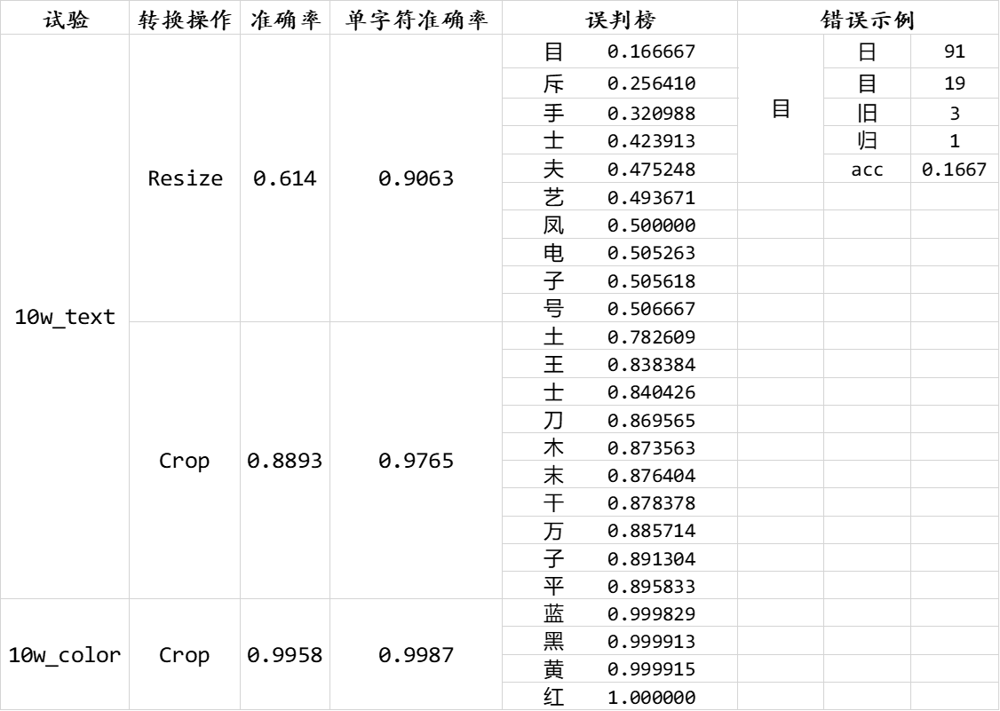
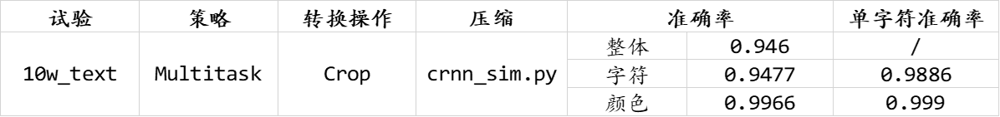
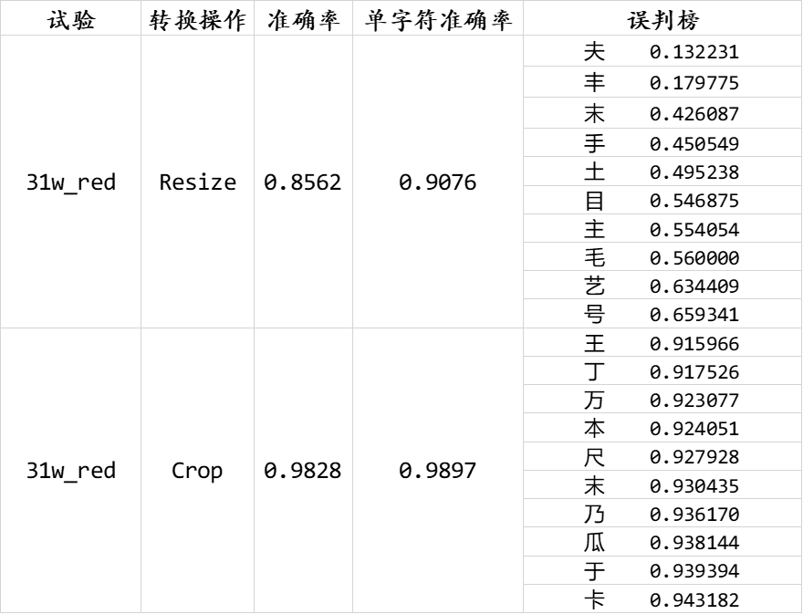
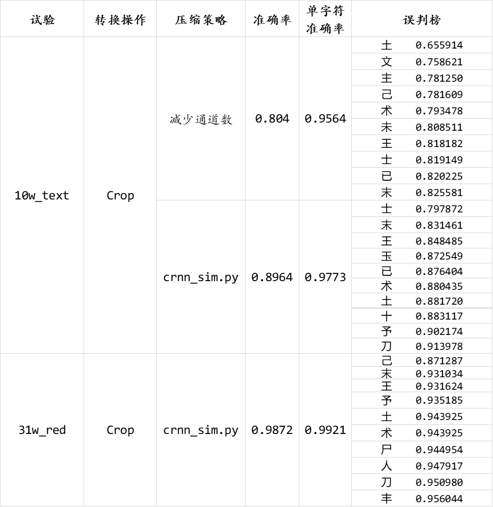

<font face="Baskerville Old Face">

# 验证码字符识别实验

**任务**：给定一张验证码的图片与指定的颜色，输出验证码中该颜色对应的字符文本。

验证码图片尺寸为 $channel*height*width=3*35*90$，其中字符由 4 种颜色的汉字、英文、阿拉伯数字随机混合而成，如下面的**龙 eo 亏巧寸\_红黄黑蓝黑红.png**。

<center>


</center>

本方案整体思路如下：


## 1. baseline

双网络预测方案，一个网络预测文本，一个网络预测颜色。

其中由于网络输入要求图片高为 32 像素，需对图片的尺寸进行调整。测试了两种方案：直接 resize 和上下裁剪 (crop)，crop 方案明显优于 resize 方案，故后续方案均采用 crop。



## 2. 双头预测 (base: crnn_sim)

同一个网络，仅在最后一层的全连接层处不同，此处展开两个分支，各自使用一个全连接层代替原来的最后一层，分别预测文本和颜色。

> 实验证明两个分支的 loss 可以相互促进。



## 3. 通道变换

由于目标只含有 4 种颜色：红、黄、蓝、黑，可将 4 种颜色通过通道变换转换为同一种颜色后，只训练一个对同一颜色进行预测的模型。如，红不变，而黄转红、蓝转红、黑转红，在训练时只关注当前图片的红色字符、预测时将指定的目标颜色转换为红色，同时忽略其它颜色的字符，这样即可得到一个只针对单一颜色进行预测的高准确率模型。由此，1 张原图基本可得到 4 张新图，扩充了数据量，而又不仅仅是一种数据增强手段，利于模型学习。



## 4. 模型压缩

1. 减少通道
2. 改良结构



## 5. 值得讨论


## 6. 设备情况

|         Item          | experiment1 | experiment2 |
| :-------------------: | :---------: | :---------: |
|          GPU          |   1080Ti    |   1080Ti    |
|         Model         |     Big     |    Small    |
| Image Size into Model |  $3*32*90$  |  $3*32*90$  |
|      Batch Size       |     64      |     64      |
|  Infer Time / Image   |   2.4 ms    |   2.4 ms    |
|          FPS          |     416     |     416     |

1. big model

```
Every 1.0s: nvidia-smi

Thu Jul 16 16:35:24 2020
+-----------------------------------------------------------------------------+
| NVIDIA-SMI 440.82       Driver Version: 440.82       CUDA Version: 10.2     |
|-------------------------------+----------------------+----------------------+
| GPU  Name        Persistence-M| Bus-Id        Disp.A | Volatile Uncorr. ECC |
| Fan  Temp  Perf  Pwr:Usage/Cap|         Memory-Usage | GPU-Util  Compute M. |
|===============================+======================+======================|
|   0  GeForce GTX 108...  Off  | 00000000:02:00.0 Off |                  N/A |
| 46%   70C    P2   222W / 250W |   1769MiB / 11170MiB |     87%      Default |
+-------------------------------+----------------------+----------------------+

+-----------------------------------------------------------------------------+
| Processes:                                                       GPU Memory |
|  GPU       PID   Type   Process name                             Usage      |
|=============================================================================|
|    0      1896      C   /usr/bin/python                             1759MiB |
+-----------------------------------------------------------------------------+
```

2. small model

```
Every 1.0s: nvidia-smi

Thu Jul 16 16:30:24 2020
+-----------------------------------------------------------------------------+
| NVIDIA-SMI 440.82       Driver Version: 440.82       CUDA Version: 10.2     |
|-------------------------------+----------------------+----------------------+
| GPU  Name        Persistence-M| Bus-Id        Disp.A | Volatile Uncorr. ECC |
| Fan  Temp  Perf  Pwr:Usage/Cap|         Memory-Usage | GPU-Util  Compute M. |
|===============================+======================+======================|
|   0  GeForce GTX 108...  Off  | 00000000:02:00.0 Off |                  N/A |
| 43%   67C    P2   189W / 250W |    897MiB / 11170MiB |     74%      Default |
+-------------------------------+----------------------+----------------------+

+-----------------------------------------------------------------------------+
| Processes:                                                       GPU Memory |
|  GPU       PID   Type   Process name                             Usage      |
|=============================================================================|
|    0     31620      C   /usr/bin/python                              887MiB |
+-----------------------------------------------------------------------------+
```
